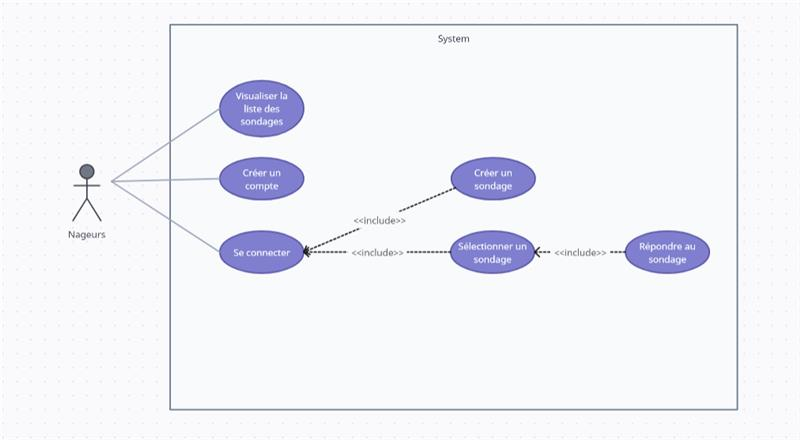
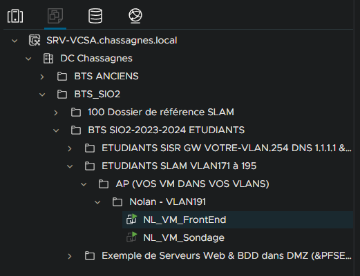

# Application Sondage "Palmoodle"

## Sommaire

- [Description](#description)
- [Diagramme de cas](#cas)
- [Technologies utilisées](#technologies)
- [Prérequis](#prérequis)
- [Utilisation](#utilisation)

## Description 

Le club « Lyon Palme » est une association sportive de nage avec palme. Il compte une quarantaine d’adhérents, son siège est à Saint Fons.
L'application Palmoodle servira à récolter régulièrement l'avis des adhérents sur des sujets divers et variés. Etant une application interne, les adhérents pourront visualiser la liste des sondages et des votes mais devront se connecter afin de voter et créer des sondages.

## Diagramme de cas d'utilisation 

## Technologies utilisées 

| Ressources | Description |
| ------ | ------ |
| Gitlab | Plateforme de développement collaborative |
| TypeScript / HTML / CSS | Langage de programmation |
| MariaDB | Système de gestion de base de données |
| Angular | Framework Front |
| Laravel | Framework de l'API |

## Prérequis 

Pour veiller au bon déroulement de l'application, il faut d'abord vous assurer que vous êtes connecté sur le réseau de l'établissement à l'aide d'un VPN si nécessaire afin d'accéder à la vm ou est censé etre hébérger l'application.

## Utilisation 

1. Si l'application est hébérger dans la ferme de serveur :

Aller sur la vm appeler "NL_VM_FrontEnd" dans un terminal puis aller dans le fichier ou est sotcké l'application grace a cette commande :"cd /websites/vuejs/palmoodle" 
puis faite "ng serve" et vous pourrez donc accéder a l'application grace a se lien : "http://localhost:4200/"

Chemin vers la vm dans la ferme :

2. Et si elle n'est pas hébérger dans la ferme :

Aller sur votre vm debian et installer npm, node et angular puis cloner le projet . (installer les version indiquer ci dessous )

| Version |        |
| ------ | ------ |
| Angular CLI | 17.3.5 |
| Node  | 18.19.0 |
| Package Manager | npm 9.2.0 |

Ensuite faite un "npm install" puis un "ng serv" et vous pourrez donc accéder a l'application grace a se lien : "http://localhost:4200/"
Il faut également récupérer l'api et pour sa il faut simplement suivre le readme de ce dépos Gitlab : "http://gitlab.chassagnes.local/grp_sio2/grp_sio2_slam/laravel/sondage"
